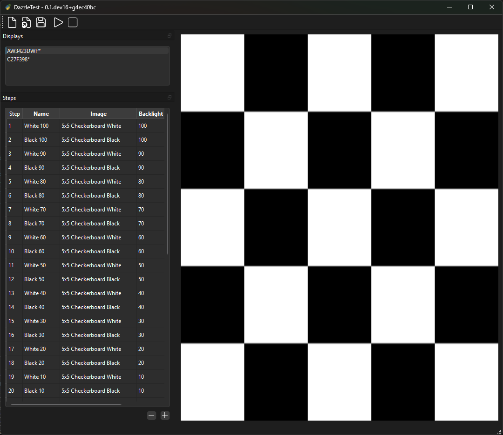

# DazzleTest ✨

Prepare to be... well, properly tested! **DazzleTest** is your go-to utility for putting displays through their paces, ensuring they shine brightly and accurately (but not *too* much, unless that's what you're testing for!).

DazzleTest is a software tool designed for anyone who needs to conduct detailed and repeatable visual tests on displays. It empowers you to create custom sequences of test images that are displayed fullscreen, each paired with a specific backlight value, giving you precise control over your testing environment.

Say goodbye to manually clicking through images and fumbling with monitor buttons – DazzleTest automates the process, especially when working with displays that support DDC/CI for backlight control.

## Key Features

* **🖥️ Custom Test Sequences:** Easily program a series of test steps. You're in full control of the testing narrative!
* **🖼️ Per-Step Image Configuration:** Assign a unique test image (e.g., patterns, photos, gradients) to each step in your sequence.
* **💡 Per-Step Backlight Control:** Define a specific backlight percentage for each test image.
* **🎯 Multi-Display Targeting:** Select exactly which connected display you want DazzleTest to focus its dazzling power on.
* **📺 Full-Screen Immersion:** Test images are displayed in full screen, eliminating distractions and providing an accurate canvas for evaluation.
* **⚙️ Automatic DDC/CI Backlight Adjustment:** For displays that support DDC/CI commands, DazzleTest will automatically set the backlight to your specified value for each step. It's like magic, but it's technology!
* **⌨️ Handy Keyboard Controls:** Navigate and control your tests with intuitive hotkeys (see "Keyboard Controls" section below).
* **💾 Save & Load Test Plans:**
    * Craft your perfect test sequence once and save it to a file.
    * Reload your test plans on any machine with DazzleTest, ensuring consistent testing methodology.
    * Share your brilliant test plans with colleagues or the community!

## How It Works

1.  **Build Your Sequence:** Use DazzleTest to create or load a test plan. For each step, specify:
    * The path to your desired test image.
    * The target backlight value (e.g., 0-100%).
2.  **Choose Your Display:** Select the monitor you wish to subject to the DazzleTest.
3.  **Run the Dazzle!:** Initiate the test sequence. DazzleTest will:
    * Display each image full screen on the chosen monitor.
    * If the display supports DDC/CI and the feature is enabled, attempt to set the backlight to your defined value for that step.
4.  **Observe & Analyze:** Carefully examine the display's performance under the various image and backlight conditions you've set.

## Keyboard Controls: Navigate Like a Pro! ⌨️

Once your DazzleTest sequence is running, or when paused, you can use these handy hotkeys to take control:

* **← (Left Arrow):** Jump back to the **previous test step**.
* **→ (Right Arrow):** Advance to the **next test step**.
* **Spacebar:**
    * **Pause** the current test step if running, or **resume** if paused.
    * **Heads up!** When DazzleTest pauses (or when you manually pause it on a very dim setting), it will temporarily **increase the display brightness**. This is super helpful if you're testing a very dark image or low backlight value and need a bit more light to observe the screen, check for issues, or make manual adjustments before resuming the specific test conditions.
* **↑ (Up Arrow):** While the test is paused, **increase the backlight value**.
* **↓ (Down Arrow):** While the test is paused, **decrease the backlight value**.
* **Esc (Escape):** **Stop** the entire test sequence and return to the main DazzleTest interface.

These controls give you the flexibility to navigate your tests efficiently and make precise adjustments as needed.

## DDC/CI: The Secret Sauce for Auto-Backlight

One of DazzleTest's most powerful features is its ability to automatically control the display's backlight. This is achieved using **DDC/CI (Display Data Channel Command Interface)**.

* **What is it?** DDC/CI is a protocol that allows your computer to communicate with your monitor and send commands, including (often) commands to adjust settings like brightness.
* **How DazzleTest uses it:** If your connected display supports DDC/CI and allows backlight control through this interface, DazzleTest can tell the monitor to set its backlight to the exact level you defined for each test step.
* **What if my display doesn't support it?** No worries! DazzleTest will still flawlessly display your test images in full screen. You'll just need to adjust the backlight manually on the monitor itself if a specific level is required for a particular test image. DazzleTest will still guide you through the image sequence.

## Getting Started

*(This section would include instructions on how to install and run DazzleTest for the first time. For example:*

* *Download the latest release from [Link to Releases Page/Download].*
* *System Requirements: Windows 10/11, macOS X.Y+, Linux Distro X.*
* *Run `DazzleTest.exe` or `./dazzletest`.)*

## Saving & Loading Test Plans

Don't let your carefully crafted test sequences go to waste! DazzleTest makes it easy to save your series of test steps (images and backlight values) to a file.

* **To Save:** Look for a "Save" or "Save Test Plan" option within the application.
* **To Load:** Use the "Load" or "Load Test Plan" option to bring a previously saved sequence back into DazzleTest.

This is perfect for:
* Repeating the exact same test on multiple displays.
* Standardizing testing procedures across a team.
* Building a library of go-to test scenarios.

---

We hope DazzleTest helps you ensure every display meets your standards and, of course, dazzles appropriately!
